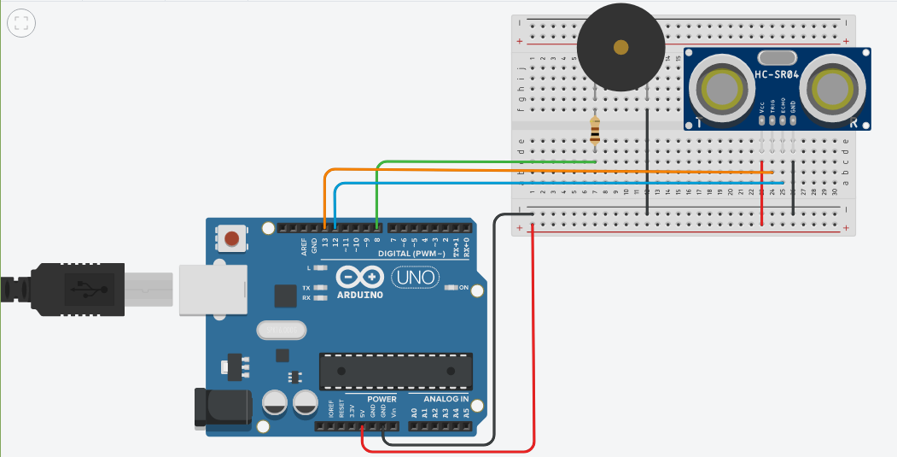

# IoT_Dashboard_POWER_BI
A simple attempt to make an IoT Dashboard using POWER BI Arduino and  Python programming. 
The Project is meant to show smart Garbage Monitoring system.

## INTRODUCTION
The project aims on making a smart Garbage Monitoring system with the help of IoT and POWER BI

### Contents

- ARDUINO_PROG.ino file contains the program required to run the arduino code with an ULTRASONIC sensor
- Upload_script.py file is used to upload data to Power BI API to our Dashboard
- Screenshots folder have the necessary output screens and a video describing the working of our BI Dashboard
## Understanding the Project
There is a complete pdf showing the complete description of the project.
But here i'll try to keep it short and go through everything i did in the two files above.

### What we need to do ??
The plan here is simple, we need to make a smart monitoring system that can alert us when our "trash can" is  empty or in general just the  capacity of the can at the moment.
##### so how do i plan to do it you might think ????
well it's pretty simple all we need is some couple of electronics and we're good to go.

#### COMPONENTS
first of all we need something that can tell us the depth of our can or the distance a layer of proximity sensors or a weight sensor could help but let just keep it simple.
also a way to process the data from our sensor so a conroller and some more things.
so our list in the end looks omething like this :
- Arduino UNO
- Ultrasonic Sensor HC-SR04
- A pizeo Buzzer (to make things irritating)
- couple of jumper wires (M-F) and (M-M) pairs
- Breadboard 
- And our serial cable for Arduino

so this list won't help without a layout for the connecctions. so let's draw !!!
well this is what our circuit looks like

now if you have ever worked with an arduino earlier you know that the circuit without a source code for the controller is well garbage!!!

so let's get our head into some coding the code source file is [ARDUINO_PROG.ino](/ARDUINO_PROG.ino) it's simple c++ and i have commented my code (i'll go to heaven i know !!! ).

so once you sucessfully get your arduino running you'll see something  like this in the serial monitor [COM_OUTPUT](screenshots/Arduino_com.JPG).
 well now what ??? we got some fancy looking numbers on our monitor but my faculty won't be impressed with that.
 Though numbers mean something for you and me not everyone can comprehend what they're trying to tell.
 we need a way of representation well guess what GRAPHS !!! you see them love them and understand them.
 
 ##### Now we need to make an interface to develop graphs for our data !!
 well i'm not a web devloper but guess what you don't have to be one.
 we are going to use a tool that will help us in devlopment, Microsoft's POWER BI
 
## POWER BI
well POWER BI  from Microsoft is a tool that let's you run graphical data analysis and to host streaming database.
#### What's a streaming Database you ask ???
well we don't need to store our data because we got plenty of it, so in order to use it we make a temproary storage container that get's empty in after some time to let new data in while you can work on your old data.
 
so we head over to POWER BI and in the "MY WORKSPACE" section make a new streaming database.
we get our api key and set our database parameters which when done right looks something like [this](screenshots/BI_DATASET_CREATION.png).
now we got our databse ready so headover to the "DASHBOARD" section and make a dashboard of your choice. 
I lack hardware because of lockdown but you can still use man things like GPS Module and stuff.
well after just simple editing your dashboard looks like [this](screenshots/dashboard.JPG)

now we need to feed our dataset so we can display some values.

How Python our simple old friend
### UPLOADING DATA TO PYTHON
well if you're familiar with some networking modules in python this is going to be easy for you.
The file is here [upload_script.py](/upload_script.py)

